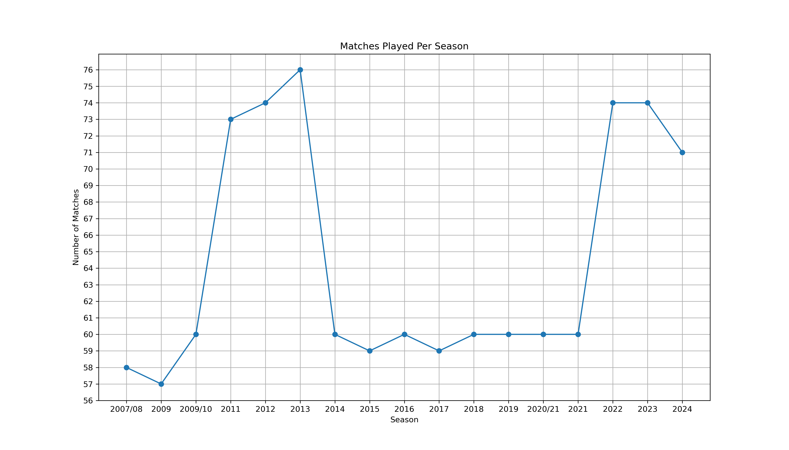
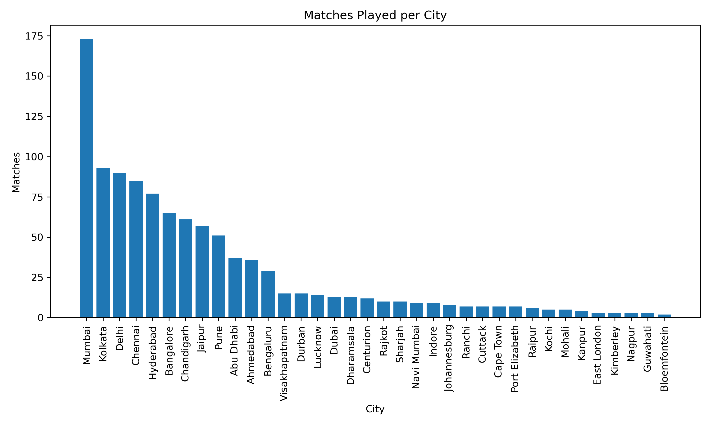
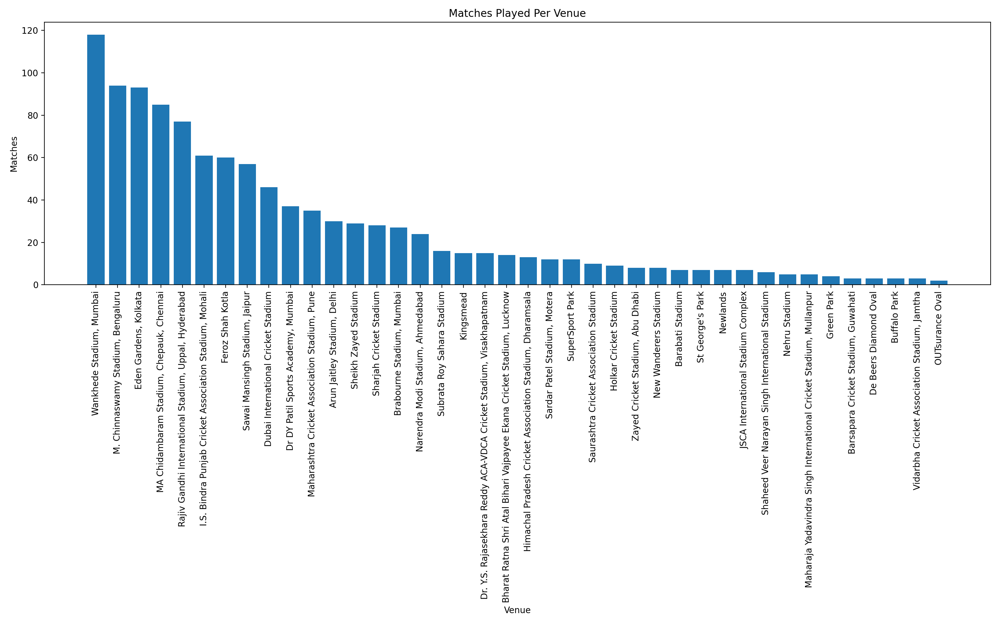
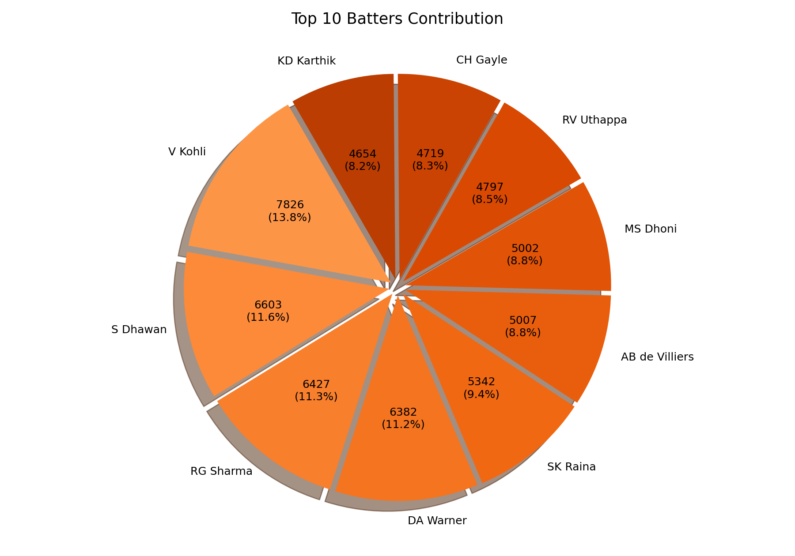
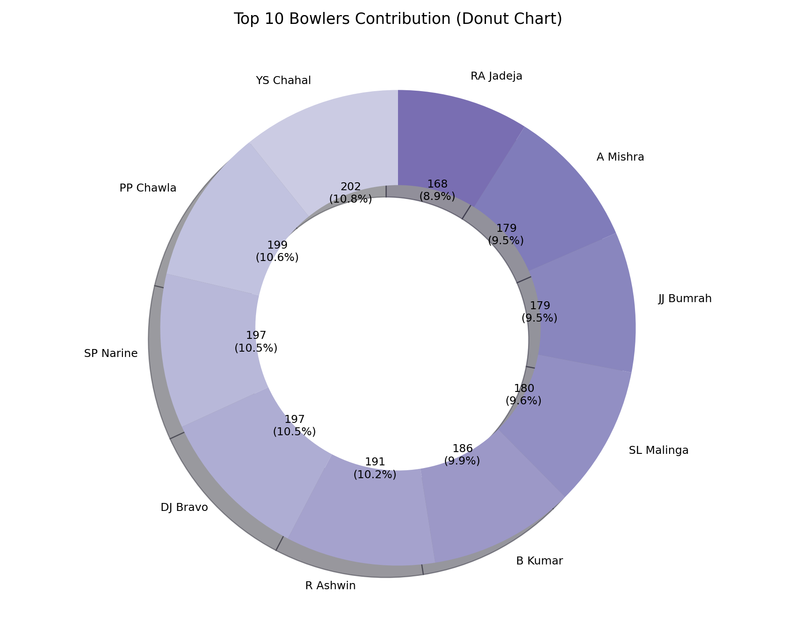
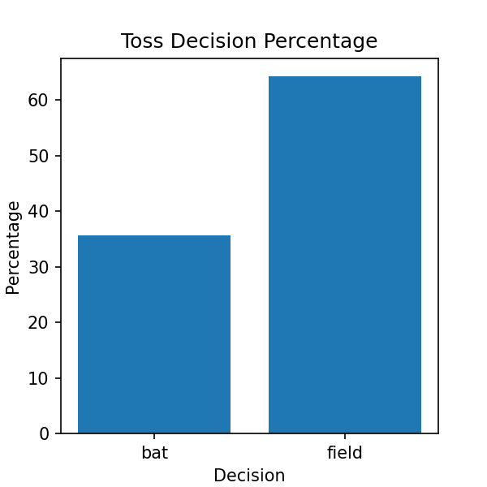
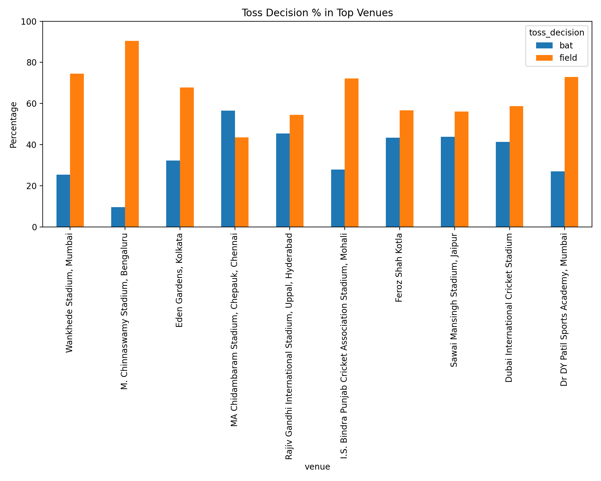
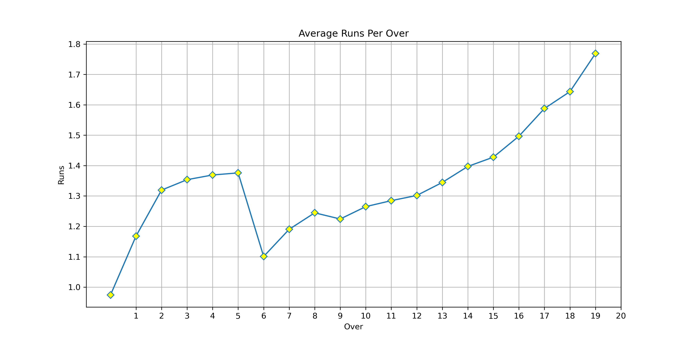
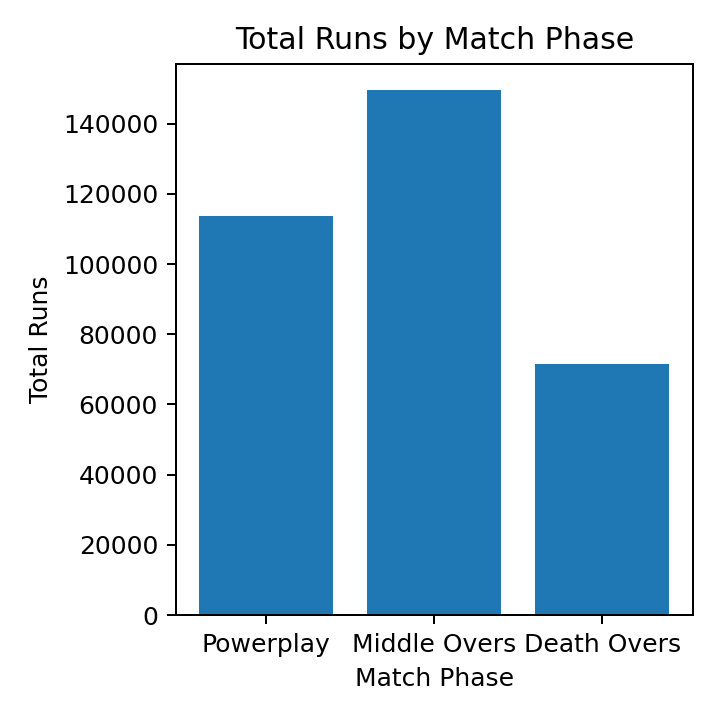

# 🏏 IPL Data Analysis Project

## 📌 Project Overview

This project performs End-to-End Data Analysis on Indian Premier League (IPL) datasets using Python.

The project follows a structured data analysis workflow including Data Understanding, Data Cleaning, Exploratory Data Analysis (EDA), Advanced Analysis, and Final Insights generation.

The goal of this project is to discover patterns, trends, and performance insights related to IPL matches, teams, venues, and strategies.

---

## 🎯 Project Workflow

This project is divided into multiple stages:

### 1️⃣ Data Understanding

* Explored dataset structure
* Checked number of rows and columns
* Identified data types
* Detected missing values
* Reviewed unique values

### 2️⃣ Data Cleaning

* Handled missing values
* Removed duplicates
* Standardized inconsistent values
* Corrected data types
* Prepared clean dataset for analysis

### 3️⃣ Exploratory Data Analysis (EDA)

* Season-wise match distribution
* Venue-wise match analysis
* Toss decision patterns
* Team performance trends
* Player contribution analysis
* Run distribution analysis
* Match outcome patterns
* Visualization using charts and graphs

### 4️⃣ Advanced Analysis

* Venue-wise Toss Analysis strategy evaluation
* Pressure-Time Bowler Strategy
* Venue wise Run Behaviour

### 5️⃣ Final Insights & Recommendations

* Key performance insights
* Strategic observations
* Match-winning trends
* Data-driven recommendations

---

## 📂 Project Structure

IPL-Data-Analysis-Project/

├── Notebooks/
│   ├── 01_Data_Understanding.ipynb
│   ├── 02_Data_Cleaning.ipynb
│   ├── 03_EDA.ipynb
│   ├── Advance analysis.ipynb
│   ├── 06_Final_Insights_Report.ipynb

├── Datasets/
│   (Dataset not included due to large file size)

├── README.md
├── requirements.txt
├── .gitignore

---

## 🛠 Tools & Technologies Used

* Python
* NumPy
* Pandas
* Matplotlib
* Jupyter Notebook

---

## 📊 Key Exploratory Data Analysis (EDA)

Some important EDA performed:

* Matches played per season
* Matches per venue
* Toss decision distribution
* Toss vs match winning analysis
* Team-wise performance trends
* Runs scored distribution
* Player performance insights
* Venue-wise scoring patterns

---

## 📈 Visualization Used

The following visualizations were created:

* Bar Charts
* Line Charts
* Pie Charts
* Distribution Plots

All visualizations were generated using Matplotlib.

---

## 📁 Dataset Information

Dataset files are not included due to large file size (>200MB).

You can download the dataset from the link below:

🔗 **Download Dataset:**
https://drive.google.com/drive/folders/1NAvGTHBE1xjAvTTY8oowxS1sPawT5A5Z?usp=sharing

After downloading, place dataset files inside the `Datasets/` folder.

## 🎯 Project Outcomes

This project helps in:

* Understanding IPL match trends
* Identifying winning strategies
* Evaluating venue performance
* Supporting data-driven cricket insights
* Practicing real-world data analysis workflow

## 🚀 Future Work

This project can be further enhanced with advanced analytics and visualization techniques.

Planned future improvements include:

* Perform **Statistical Analysis** such as hypothesis testing and correlation analysis to validate patterns in team performance.

* Apply **Machine Learning Models** such as Logistic Regression to predict match outcomes based on features like toss result, venue, and team composition.

* Integrate **New IPL Data** from recent seasons to keep the analysis updated and improve prediction accuracy.

* Develop an **Interactive Dashboard using Power BI** to visualize key insights such as team performance, venue trends, and player statistics in a user-friendly manner.

* Explore **Predictive Modeling** to forecast match-winning probabilities and team performance trends.

These enhancements will transform the project from descriptive analytics to predictive analytics and business intelligence.

## 📊 Sample Visualizations

### Matches per Season

---

### Matches per City

---

### Matches per Venue

---

### Top Batters

---

### Top Bowlers

---

### Toss Decision Percentage

---
### Toss Decision Percentage In Top Venue

### Average Runs per Over

---

### Total Runs by Match Phase

---

## 👩‍💻 Author

Muskan Patel
B.Tech Computer Science Engineering
Aspiring Data Analyst 
